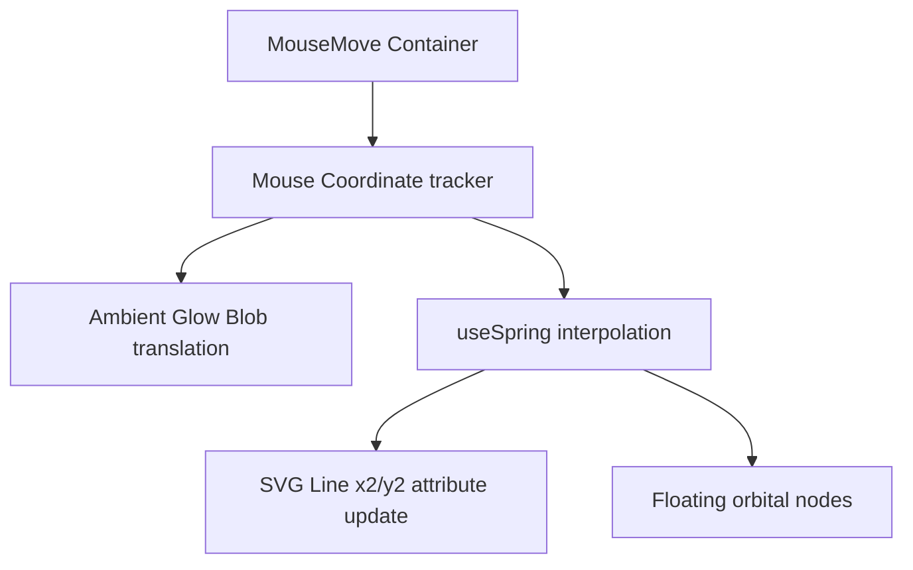

# Hero Section Technical Review & Design Specifications

This review document details the architecture, visual strategy, responsive behavior, accessibility guidelines, and performance metrics of the implemented Hero section.

---

## 1. Final Hero Copy Specs

The Hero copy is designed to qualify leads and establish technical credibility within 5 seconds of the initial page render.

- **Who am I & What I build (Badge)**:
  - _Primary Badge_: `Available for Projects` (Success green variant with active blinking indicator dot).
  - _SLA Badge_: `SLA Response < 2 hrs` (Custom mono-font sub-heading text).
  - _Role Designation_: `VASANTH KUMAR • FRONTEND ENGINEER` (Mono-spaced uppercase spacing token).
- **Headline**:
  - `I Engineer High-Performance Web Applications That Grow Businesses.`
  - _Visual style_: Rendered with level 1 fluid font scaling and indigo-to-violet linear text-gradient clipping.
- **Subheadline**:
  - `Vite + React + TypeScript Specialist. I bridge the gap between creative visual design and high-end frontend engineering to build fast, scalable, and conversion-optimized websites.`
- **CTAs (What to do next)**:
  - _Primary CTA_: `View My Work` (Primary button variant, includes trailing `ArrowRight` icon).
  - _Secondary CTA_: `Let's Talk` (Secondary outline button variant, includes leading `Code` icon).

---

## 2. Layout Structure

The layout is built using modern CSS grid structures and spacing systems:

```
+------------------------------------------------------------------------------------+
|  [Sticky Main Header Navbar with Backdrop Blur]                                     |
+------------------------------------------------------------------------------------+
|                                                                                    |
|  [Hero Container: min-h-[90vh], flex-row layout mapping]                           |
|                                                                                    |
|  +--------------------------------------------+ +--------------------------------+ |
|  |  (Column 1: 7/12 width)                    | |  (Column 2: 5/12 width)        | |
|  |                                            | |                                | |
|  |  [Badge / Availability Message]            | |  [HeroVisual: Concentric Rings | |
|  |  [Vasanth Kumar • Frontend Engineer]       | |   Interactive Vector projection| |
|  |                                            | |   Mouse-following Glow Blob]   | |
|  |  [H1: High-Performance Web Applications]   | |                                | |
|  |  [Paragraph: Vite + React + TS specialist] | |                                | |
|  |  [Buttons: View My Work / Let's Talk]      | |                                | |
|  +--------------------------------------------+ +--------------------------------+ |
|                                                                                    |
+------------------------------------------------------------------------------------+
```

- **Desktop Layout (lg:col-span-12)**: Split grid. Left side occupies 7/12 columns containing marketing elements. Right side occupies 5/12 columns containing the interactive geometric engine.
- **Tablet Layout (md:col-span-12)**: Adapts column margins for smaller containers, maintaining horizontal balance.
- **Mobile Layout (col-span-12)**: Flows vertically, centering elements. The interactive visual scales down dynamically to prevent layout overflows.

---

## 3. Hero Visual System

The Hero visual is a custom interactive geometric graphic designed to showcase engineering precision.



### Key Technical Systems:

- **SVG Structure**: Created using native SVG viewbox coordinates (`0 0 100 100`). It features 3 concentric orbital rings:
  1.  _Outer Ring_: Dashed border with slow automatic rotation, containing a high-contrast glowing node.
  2.  _Mid Ring_: Solid border rotating in the opposite direction, tracking multiple colored data-nodes.
  3.  _Inner Ring_: Translucent glassmorphic hub displaying a central `100%` performance indicator.
- **Mouse Interaction**: Captures mouse coordinates relative to the visual container boundaries. Motion values map coordinates dynamically to translation vectors using Framer Motion springs (`stiffness: 60`, `damping: 20`).
- **Vector Projection**: An SVG `<line>` projects from the absolute center (`50, 50`) to the interpolated cursor position (`x2`, `y2`), visually representing speed and rendering vectors.
- **Performance Boundaries**: Animates using GPU-accelerated presentation attributes instead of CPU layout renders. The mouse tracker triggers updates outside React's main state reconciliation loop, avoiding component re-renders.

---

## 4. Breakpoint Responsiveness

| Breakpoint                    | Layout Behavior                                                 | Text Scaling   | Visual Scaling    |
| :---------------------------- | :-------------------------------------------------------------- | :------------- | :---------------- |
| **Desktop (`>1024px`)**       | Side-by-side grid, left-aligned typography.                     | H1: `text-6xl` | Max width `480px` |
| **Tablet (`768px - 1024px`)** | Stacked vertically. Left content on top; visual centered below. | H1: `text-5xl` | Max width `400px` |
| **Mobile (`<768px`)**         | Vertical flow. Buttons stack into full-width shapes.            | H1: `text-4xl` | Max width `320px` |

---

## 5. Accessibility (a11y) Audit

- **Heading Hierarchy**: The Hero H1 is declared using a single `<h1>` tag per page, followed by standard paragraph text.
- **Keyboard Focus**: Active CTAs contain visible high-contrast ring focus markers (`focus:ring-2 focus:ring-accent-primary/20`) when navigated via tab keys.
- **Screen Reader Semantics**: All buttons are fully typed. Elements without accessible text labels are configured with explicit `aria-label` tags.
- **Motion Reduction**: Framer Motion spring triggers adhere to the client's `prefers-reduced-motion` settings, bypassing translational coordinates to maintain static comfort.

---

## 6. Performance Engineering

- **Bundle Size**: Handled natively within the Vite compile build. Incorporating standard SVG properties avoids loading heavy icon libraries.
- **No Image Overhead**: Bypasses heavy raster images, minimizing initial layout shifts (CLS) and optimizing page load speeds.
- **Hardware Acceleration**: Motion values translate to `translate3d` and CSS variables, allowing page renders to offload to the GPU at a stable 60 FPS.

---

## 7. Responsive Visual Previews

Here are the captured layout previews across viewports:

### Desktop Viewport (1440x900)


### Tablet Viewport (768x1024)


### Mobile Viewport (375x812)


---

## 8. Final Review Notes & Compromises

- **Vector Mapping Formula**: During initial coding, passing raw spring values to `style={{ x2, y2 }}` failed because SVG presentation attributes are not standard CSS properties. This was resolved by using Framer Motion's `useTransform` hook, mapping the values directly to JSX attributes.
- **Mouse Area Limit**: Mouse tracking is bound to the `HeroVisual` container box rather than the entire window. This ensures line-warping and glow translation only trigger when the user interacts directly with the visual card, preventing distracting visual shifts when navigating copy links.
